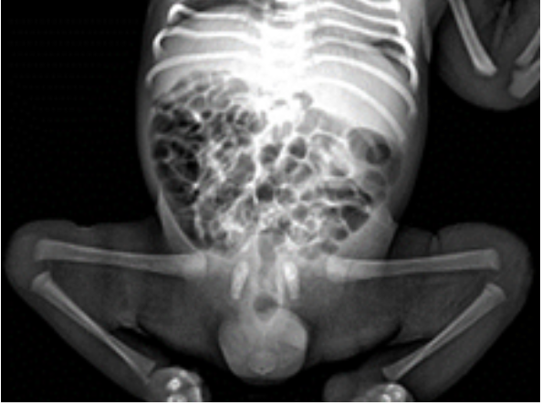
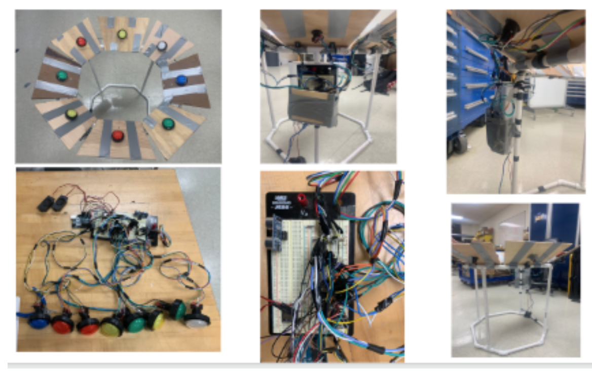
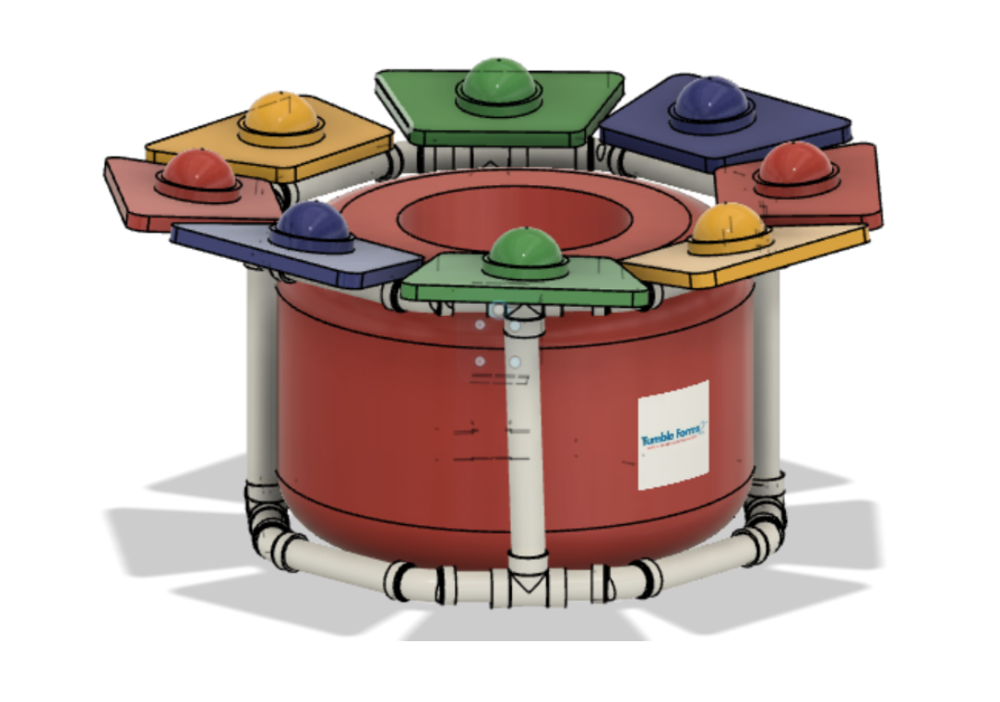
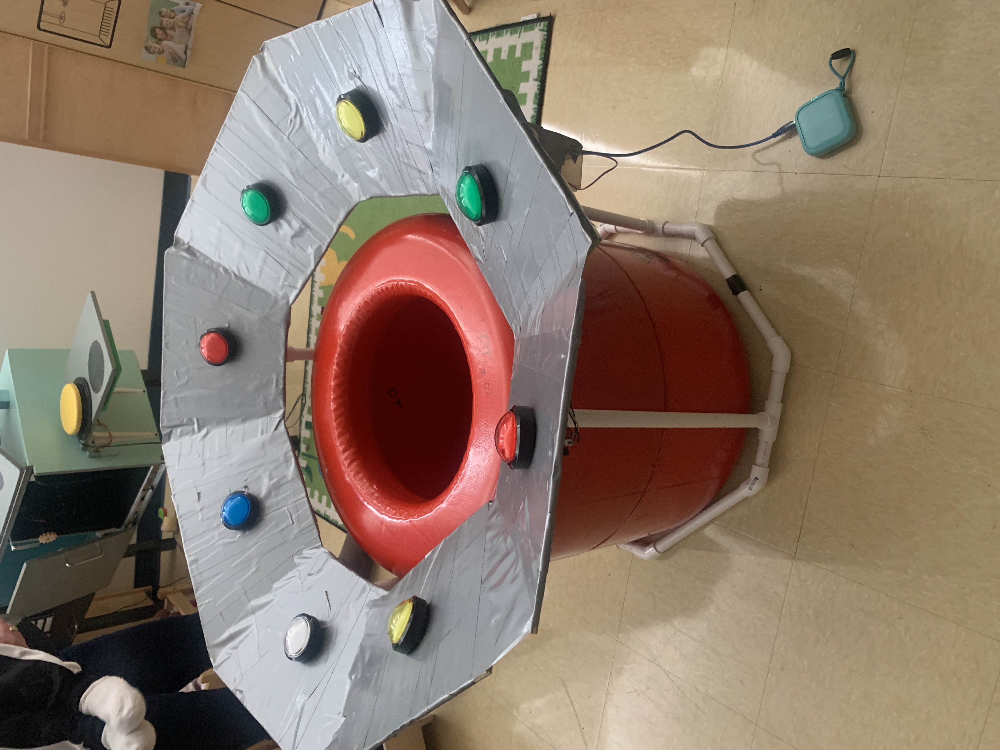
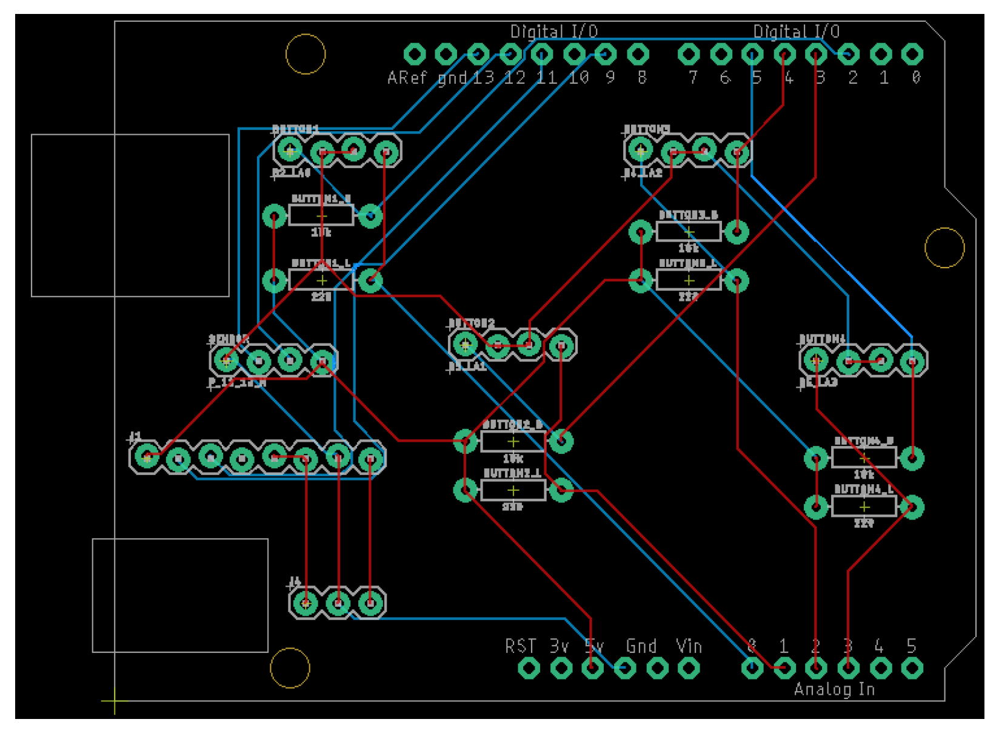
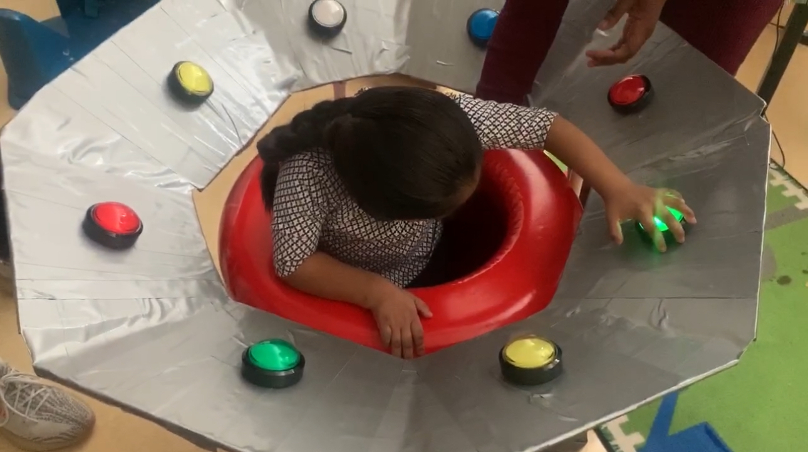

# Interactive Tunnel for Children with Postural and Intellectual Disabilities

**More info in the report!**

## Demo
video demo: https://www.youtube.com/channel/UC9Hpmn_VhsW2zUZRCOahGSQ

## Summary

Research shows that approximately 38% of children are born with some form of postural disorder. A common technique used to correct these types of disorders in children, comes in the form of an upright tunnel. This type of tunnel is usually referred to as a Barrel Crawl tunnel. Children with postural disorders are placed into this type of tunnel for physical therapy and encouraged to cruise around the diameter of the tunnel. This technique serves to promote straightening of the legs and spine, and ultimately corrects the overall posture of the child.

Spine x-ray of infant with caudal regression

A Durham public school staff member approached our research group for assistance. They claimed that the current tunnel device did not succeed in keeping the children’s attention, for the duration of their therapy. The children also frequently chose to sit down inside the tunnel, which defeated the purpose. The children in this classroom also exhibited a wide variety of intellectual disabilities. Our group was asked to make the device more captivating for the clients, so that they would be engaged for the duration of the therapy session. After much ideation and prototyping, an external device was placed on top of the current tunnel to help solve this issue. We included a motion sensor and LED lights, that would determine if the client is sitting inside the tunnel. The LED lights flashed when touched and animal sounds were activated to stimulate the clients attention. The device allows for either a simple Simon Say’s game or a free play option.

## Design

Pictures of the initial designs

Prototype

Tunnel external device final solution

Optimized PCB 

Real-world testing

